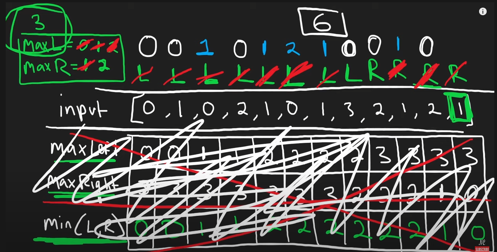

**Using Two Pointer Approach**

We can use the same concept of min(l, r) with two pointer approach.

`
Use l = start, r = end - 1
Update leftMax and rightMax.
if leftMax < rightMax = leftMax ++
then update the result
else
then update the result
rightMax --
`